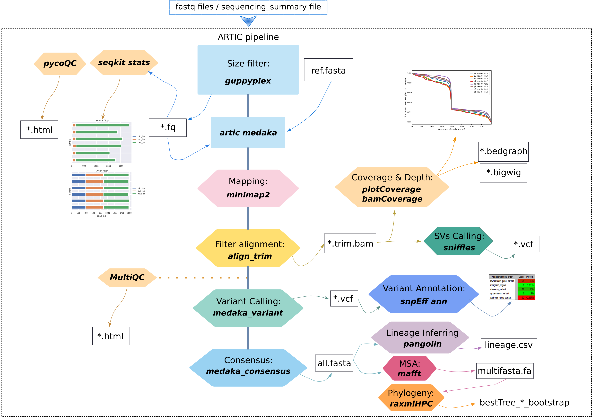

# ONTdeCIPHER

ONTdeCIPHER is an amplicon-based Oxford Nanopore Technology (ONT) sequencing pipeline to perform key downstream analyses on raw sequencing data from quality testing to SNPs effect to phylogenetic analysis. 
ONTdeCIPHER integrates 13 bioinformatics tools, including Seqkit, ARTIC bioinformatics tool, PycoQC, MultiQC, Minimap2, Medaka, Nanopolish, Pangolin (with the model database pangoLEARN), Deeptools (PlotCoverage, BamCoverage), Sniffles, MAFFT, RaxML and snpEff. 
The users can pre-process their data and obtain the sequencing statistics, reconstruct the consensus genome, identify variants and their effects for each viral isolate, infer lineage, and perform multi-sequence alignments and phylogenetic analyses. 
Currently, ONTdeCIPHER is mainly used to analyze the genetic diversity of SARS-CoV-2. However, any amplicon-based genome of pathogens can be analyzed if the primers scheme and a reference genome are available. 

<p align="center">

</p>

## Installation
### Requirements:
Python >=3\
Conda
### 1. Downloading the source:
```sh
git clone https://github.com/emiracherif/ONTdeCIPHER
cd ONTdeCIPHER
```
### 2. Installing dependencies:

#### For Linux distributions
```sh
conda env create --name ontdecipher --file=Environments/ontdecipher_linux.yml
```
#### For macOS 
```sh
conda env create --name ontdecipher --file=Environments/ontdecipher_macOS.yml
```
### 3. Installing artic & pangolin:
to install artic : 
```sh
conda activate ontdecipher
cd fieldbioinformatics && python setup.py install
```

to install pangolin : 
```sh
cd ../Pangolin && bash install_pangolin.sh
```

## Usage
Before running ONTdeCIPHER, you will need first to create a working directory then put into it all your sequencing data (fastq and fasta files). ONTdeCIPHER will output the results in the working directory. 


### Structure of the working directory

	Working_Directory
		├── fastq_pass
		│   ├── barcode01
		│   ├── barcode02
		├── fast5_pass
		│   ├── barcode01
		│   ├── barcode02


### To run the ONTdeCIPHER :

You have to run the master script `run_ONTdeCIPHER.py` from working directory by:
1) activating ONTdeCIPHER conda environment:

```sh
conda activate ontdecipher
```

2) running the master script

```sh
python3 absulote_path_to_script_directory/run_ONTdeCIPHER.py --step pip_core --params config.txt --samples config_samplename.tsv -t 10
```

`--step` : can be one of the following values: `pycoQC` , `pip_core` , `m_r_p` . To run all steps you can use : `all` .

`pycoQC` runs only PycoQC (computes metrics and generates interactive QC plots for Oxford Nanopore technologies sequencing data)
`pip_core`  runs ONTdeCIPHER core pipeline (artic, seqKit, DeepTools, snpEff)
`m_r_p` runs mafft, raxmlHPC and Pangolin
`all` runs `pycoQC` (if sequencing_summary.txt file is provided), `pip_core` & `m_r_p`


`--params` : a config file containing some parameters to run the pipeline.
#### Example:

	input_fastq="path_to_fastq_pass_directory/fastq_pass"
	input_fast5="path_to_fast5_pass_directory/fast5_pass"
	input_sequence_summary="path_to_sequencing_summary_file/sequencing_summary_xxx.txt"
	min="400" # minimum read length
	max="700" # maximum read length
	name="name_bootstrap" # RaxML output name
	reference_genome_snpEff ="MN908947.3" # SARS-CoV-2 reference in the snpEff data base.

`--samples` : a config file to associate barcodes with sample names. 
#### Example:

	#barcode<tab>sampleName
	barcode01	e1
	barcode02	e2
	barcode03	e3
	barcode04	e4
	barcode05	p1
	barcode06	p2
	barcode07	p3
	barcode08	p4

`--threads/-t` : Maximum number of threads to use. Default: 4

### Pipeline output results

After running ONTdeCIPHER steps your working directory will the following files and folders.


	├── DagFiles
	├── RAxML_bestTree.name_bootstrap
	├── RAxML_bipartitions.name_bootstrap
	├── RAxML_bipartitionsBranchLabels.name_bootstrap
	├── RAxML_bootstrap.name_bootstrap
	├── RAxML_info.name_bootstrap
	├── Step1_usedConfigs
	├── Step2_artic_guppyplex_filter
	├── Step3_artic_medaka_result
	├── Step4_artic_nanopolish_result
	├── Step5_snpEff_result
	├── Step6_plotCoverage_result
	├── Step7_bamCoverage_result
	├── Step8_consensus_fasta
	├── Summary
	├── fast5_pass
	├── fastq_pass
	├── global_lineage_information.csv
	├── lineage_report.csv
	└── report.html

Data to test ONTdeCIPHER and the results you will obtain are available here:

https://osf.io/jd2vz/?view_only=6d333ddc5a3045d297d5e3cc59e7e461
## Tips
SnpEff needs a database to perform genomic annotations. There are pre-built databases for thousands of genomes.
So to know which genomes have a pre-built database run (ONTdeCIPHER environment needs to be activated):
```sh
java -jar snpEff.jar databases
```
If your genome is absent from the database, you can build your database (see http://pcingola.github.io/SnpEff/se_buildingdb/).

## References
### Pre-processing and quality control
Adrien Leger, Tommaso Leonardi, February 28, 2019, pycoQC, interactive quality control for Oxford Nanopore Sequencing
(https://tleonardi.github.io/pycoQC/)

Wei Shen, Shuai Le, Yan Li, Fuquan Hu, October 5, 2016, SeqKit: A Cross-Platform and Ultrafast Toolkit for FASTA/Q File Manipulation
(https://bioinf.shenwei.me/seqkit/)  

Fidel Ramírez, Friederike Dündar, Sarah Diehl, Björn A. Grüning, Thomas Manke, May 05, 2014, deepTools: a flexible platform for exploring deep-sequencing data
(https://deeptools.readthedocs.io/en/develop/content/installation.html)

Ewels, P., Magnusson, M., Lundin, S., & Käller, M. (2016). MultiQC: summarize analysis results for multiple tools and samples in a single report
(https://multiqc.info/)

### Genome reconstruction and genomic analysis
Nick Loman, Andrew Rambaut, Jannuary 22, 2020, nCoV-2019 novel coronavirus bioinformatics environment setup 
(https://artic.network/ncov-2019/ncov2019-it-setup.html)

Sedlazeck, F.J., Rescheneder, P., Smolka, M. et al. Accurate detection of complex structural variations using single-molecule sequencing
(https://github.com/fritzsedlazeck/Sniffles)

Pablo Cingolani et al, April 01, 2012, SnpEff: A program for annotating and predicting the effects of single nucleotide polymorphisms  
(http://pcingola.github.io/SnpEff/se_introduction/)

Katoh, Rozewicki, Yamada, 2019, MAFFT online service: multiple sequence alignment, interactive sequence choice and visualization    
(https://mafft.cbrc.jp/alignment/software/)

Alexandros Stamatakis, January 21, 2014, RAxML: a tool for phylogenetic analysis and post-analysis of large phylogenies 
(https://www.metagenomics.wiki/tools/phylogenetic-tree/construction/raxml)  

Andrew Rambaut et al, July 15 2020, A dynamic nomenclature proposal for SARS-CoV-2 lineages to assist genomic epidemiology 
(https://cov-lineages.org/pangolin.html)


## Project contributors

* Fatou Seck Thiam (BCD/ISEM/IRD), Marine Combe (ISEM/IRD),Georgina Rivera-Ingraham (ISEM/IRD), Fabienne Justy (ISEM/UM), Damien Breugnot (ISEM/IRD), Mohammad Salma (IGMM), Marie-ka Tilak (ISEM), Jean-Claude Doudou (IRD Cayenne), Rodolphe E. Gozlan (ISEM/IRD) and Emira Cherif (ISEM/IRD).
* **Written by Fatou Seck Thiam, Mohammad Salma and Emira Cherif.**


## Contact 
emira.cherif@ird.fr

## License
Licencied under CeCill-C (http://www.cecill.info/licences/Licence_CeCILL-C_V1-en.html) and GPLv3.                                                  

Intellectual property belongs to IRD and authors.

 

