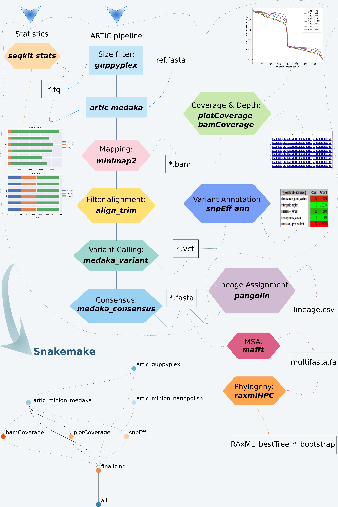

# deCIPHER

deCIPHER is a  scalable, modular and traceable snakemake pipeline for amplicon-based nanopore sequencing for tracking SARS-CoV-2 variants.
deCIPHER integrates 11 bioinformatics tools, including Seqkit, ARTIC bioinformatics tool, PycoQC, Minimap2, Medaka, Nanopolish, Pangolin (with the model database pangoLEARN), Deeptools (PlotCoverage, BamCoverage), MAFFT, RaxML and snpEff. It is a standalone pipeline compatible with Ubuntu distributions and macOS, implemented in Python3, including two easy-to-use configuration files. With a single command line and the raw sequencing data as input, the user can preprocess the data, obtain the statistics on sequencing quality, depth and coverage. Then, reconstruct the consensus genome sequences, identify the variants and their potential associated effects for each viral isolate, and, finally, perform the multi-sequence alignments and phylogenetic analyses.

## Installation
You can install all dependencies using this command line:
### For Linux distributions
`conda env create --name decipher --file=decipher_linux.yml`
### For macOS 
`conda env create --name decipher --file=decipher_macOS.yml`

## Usage
Before running deCIPHER, you will need first to create a working directory then put into it all your sequencing data (fastq and fasta files). deCIPHER will output the results in the working directory. 

### Structure of the working directory

	Working_Directory
		├── fastq_pass
		│   ├── barcode01
		│   ├── barcode02
		├── fast5_pass
		│   ├── barcode01
		│   ├── barcode01

### To run the deCIPHER :

You have to run the master script `run_deCIPHER.py` from working directory by:
1) activating deCIPHER conda environment:

`conda activate decipher`

2) running the master script

`python3 path_to_script_directory/run_deCIPHER.py --step pip_core--params config.txt --samples config_samplename.tsv -t 10`

`--step` : can be one of the following values: `pycoQC` , `pip_core` , `m_r_p` . To run all steps you can use : `all` .

`pycoQC` *"PycoQC computes metrics and generates interactive QC plots for Oxford Nanopore technologies sequencing data"* (https://tleonardi.github.io/pycoQC/)
`pip_core`  runs deCIPHER core pipeline (artic, seqKit, DeepTools, snpEff)
 `m_r_p` runs mafft, raxmlHPC and Pangolin
`all` runs `pip_core` & `m_r_p`

`--params` : a config file containing some parameters to run the pipeline.
#### Example:

	input_fastq="path_to_fastq_pass_directory/fastq_pass"
	input_fast5="path_to_fast5_pass_directory/fast5_pass"
	input_sequence_summary="path_to_sequencing_summary_file/sequencing_summary_xxx.txt"
	min="400" # minimum read length
	max="700" # maximum read length
	name="name_bootstrap" # RaxML output name
	reference_genome_snpEff ="MN908947.3" # SARS-CoV-2 reference in the snpEff data base.

`--samples` : a config file to associate barcodes with sample names. 
#### Example:

	#barcode<tab>sampleName
	barcode01	e1
	barcode02	e2
	barcode03	e3
	barcode04	e4
	barcode05	p1
	barcode06	p2
	barcode07	p3
	barcode08	p4

`--threads/-t` : Maximum number of threads to use. Default: 4

### Pipeline output results

After running deCIPHER steps your working directory will the following files and folders.

	├── DagFiles
	├── RAxML_bestTree.name_bootstrap
	├── RAxML_bipartitions.name_bootstrap
	├── RAxML_bipartitionsBranchLabels.name_bootstrap
	├── RAxML_bootstrap.name_bootstrap
	├── RAxML_info.name_bootstrap
	├── Step1_usedConfigs
	├── Step2_artic_guppyplex_filter
	├── Step3_artic_medaka_result
	├── Step4_artic_nanopolish_result
	├── Step5_snpEff_result
	├── Step6_plotCoverage_result
	├── Step7_bamCoverage_result
	├── Step8_consensus_fasta
	├── Summary
	├── fast5_pass
	├── fastq_pass
	├── global_lineage_information.csv
	├── lineage_report.csv
	└── report.html
### References
Adrien Leger, Tommaso Leonardi, February 28, 2019, pycoQC, interactive quality control for Oxford Nanopore Sequencing (https://tleonardi.github.io/pycoQC/)

Wei Shen, Shuai Le, Yan Li, Fuquan Hu, October 5, 2016, SeqKit: A Cross-Platform and Ultrafast Toolkit for FASTA/Q File Manipulation
(https://bioinf.shenwei.me/seqkit/)  

Nick Loman, Andrew Rambaut, Jannuary 22, 2020, nCoV-2019 novel coronavirus bioinformatics environment setup 
(https://artic.network/ncov-2019/ncov2019-it-setup.html)

Fidel Ramírez, Friederike Dündar, Sarah Diehl, Björn A. Grüning, Thomas Manke, May 05, 2014, deepTools: a flexible platform for exploring deep-sequencing data,  (https://deeptools.readthedocs.io/en/develop/content/installation.html)

Pablo Cingolani et al, April 01, 2012, A program for annotating and predicting the effects of single nucleotide polymorphisms, SnpEff  
(http://pcingola.github.io/SnpEff/se_introduction/)

Katoh, Rozewicki, Yamada, 2019, MAFFT online service: multiple sequence alignment, interactive sequence choice and visualization    
(https://mafft.cbrc.jp/alignment/software/)

Alexandros Stamatakis, January 21, 2014, RAxML: a tool for phylogenetic analysis and post-analysis of large phylogenies 
(https://www.metagenomics.wiki/tools/phylogenetic-tree/construction/raxml)  

Andrew Rambaut et al, July 15 2020, A dynamic nomenclature proposal for SARS-CoV-2 lineages to assist genomic epidemiology 
(https://cov-lineages.org/pangolin.html)

 

