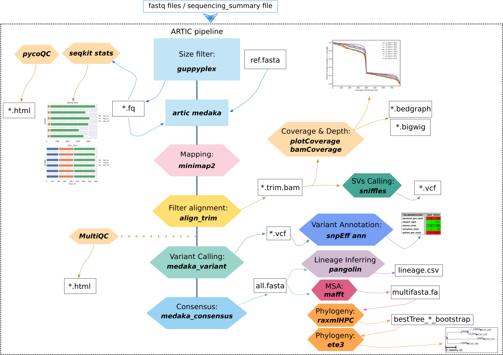

# ONTdeCIPHER

ONTdeCIPHER is an Oxford Nanopore Technology (ONT) amplicon-based sequencing pipeline to perform key downstream analyses on raw sequencing data from quality testing to SNPs effect to phylogenetic analysis. 
ONTdeCIPHER integrates 13 bioinformatics tools, including Seqkit, ARTIC bioinformatics tool, PycoQC, MultiQC, Minimap2, Medaka, Nanopolish, Pangolin (with the model database pangoLEARN), Deeptools (PlotCoverage, BamCoverage), Sniffles, MAFFT, RaxML and snpEff. 
The users can pre-process their data and obtain the sequencing statistics, reconstruct the consensus genome, identify variants and their effects for each viral isolate, infer lineage, and perform multi-sequence alignments and phylogenetic analyses. 
Currently, ONTdeCIPHER is mainly used to analyze the genetic diversity of SARS-CoV-2. However, any amplicon-based genome of pathogens can be analyzed if the primers scheme and a reference genome are available. 

<p align="center">

</p>

## Installation
### Requirements:
Python >=3\
Conda >=3

### 1. Downloading the source:
```sh
git clone https://github.com/emiracherif/ONTdeCIPHER
cd ONTdeCIPHER
```
### 2. Installing dependencies:

#### For Linux distributions
```sh
conda env create --name ontdecipher --file=Environments/ontdecipher_linux.yml
```
#### For macOS 
```sh
conda env create --name ontdecipher --file=Environments/ontdecipher_macOS.yml
```
For macOS users please check Tips section below. As Medaka is not compatible with Apple Silicon chip, ONTdeCIPHER does not currently run on Apple's Silicon chip equipped-devices.
### 3. Installing artic & pangolin:
to install artic : 
```sh
conda activate ontdecipher
cd fieldbioinformatics && python setup.py install
```

to install pangolin : 
```sh
cd ../Pangolin && bash install_pangolin.sh
```
This step allows having the last version of pangolin and pangoLEARN.
## Usage
Before running ONTdeCIPHER, you will need first to create a working directory then put into it all your sequencing data (fastq/fastq.gz and fast5 files). ONTdeCIPHER will output the results in the working directory. 


### Structure of the working directory

	Working_Directory
		├── fastq_pass
		│   ├── barcode01
		│   ├── barcode02
		├── fast5_pass
		│   ├── barcode01
		│   ├── barcode02


### To run ONTdeCIPHER :

You have to run the master script `run_ONTdeCIPHER.py` from working directory by:
1) activating ONTdeCIPHER conda environment:

```sh
conda activate ontdecipher
```

2) running the master script

```sh
python3 absolute_path_to_script_directory/run_ONTdeCIPHER.py --step pip_core --params config.txt --samples config_samplename.tsv -t 10
```

`--step` : can be one of the following values: `pycoQC` , `pip_core` , `mafft_raxm`, `pangolin`, `plots`, `multiqc`. To run (pycoQC --> pip_core --> mafft, raxmlHPC and pangolin) you can use : `all` .

`pycoQC` runs only PycoQC (computes metrics and generates interactive QC plots for Oxford Nanopore technologies sequencing data).
`pip_core`  runs ONTdeCIPHER core pipeline (artic, seqKit, DeepTools, snpEff).
`mafft_raxm` runs mafft and raxmlHPC.
`pangolin` runs pangolin.
`plots` runs plot stats function and plot_tree script.
`multiqc` runs multiqc.
`all` runs `pycoQC` (if sequencing_summary.txt file is provided), `pip_core`, `mafft_raxm` & `pangolin`.


`--params` : the config.txt file containing the parameters to run the pipeline.
#### Example:

	input_fastq="absulote_path_to_fastq_pass_directory/fastq_pass"
	input_fast5="absulote_path_to_fast5_pass_directory/fast5_pass"
	input_sequence_summary="path_to_sequencing_summary_file/sequencing_summary_xxx.txt"
	# minimum read length
	min="400"
	# maximum read length
	max="700" 
	# RaxML output name
	name="name_bootstrap"
	# SARS-CoV-2 reference in the snpEff data base.
	reference_genome_snpEff ="MN908947.3"
	# absolute path to sniffles
	sniffles="absolute_path_to_sniffles"
	

`--samples` : a config file to associate barcodes with sample names.
#### Example:

	#barcode<tab>sampleName
	barcode01	e1
	barcode02	e2
	barcode03	e3
	barcode04	e4
	barcode05	p1
	barcode06	p2
	barcode07	p3
	barcode08	p4

`--threads/-t` : Maximum number of threads to use. Default: 4

`--cluster` : The cluster submission command. Ex: sbatch --time=12:00:00 etc. Only SBATCH cluster is supported for now. Default: none
### Pipeline output results

After running ONTdeCIPHER steps you will hava in your working directory the following files and folders.


	├── DagFiles
	├── RAxML_bestTree.name_bootstrap
	├── RAxML_bipartitions.name_bootstrap
	├── RAxML_bipartitionsBranchLabels.name_bootstrap
	├── RAxML_bootstrap.name_bootstrap
	├── RAxML_info.name_bootstrap
	├── Step1_usedConfigs
	├── Step2_artic_guppyplex_filter
	├── Step3_artic_medaka_result
	├── Step4_artic_nanopolish_result
	├── Step5_snpEff_result
	├── Step6_plotCoverage_result
	├── Step7_bamCoverage_result
	├── Step8_sniffles_result
	├── Step9_consensus_fasta
	├── Summary
	├── fast5_pass
	├── fastq_pass
	├── global_lineage_information.csv
	├── lineage_report.csv
	└── report.html

Data to test ONTdeCIPHER and the results you will obtain are available here:

https://osf.io/jd2vz/?view_only=6d333ddc5a3045d297d5e3cc59e7e461
## Tips
**SnpEff**
 
SnpEff needs a database to perform genomic annotations. There are pre-built databases for thousands of genomes.
So to know which genomes have a pre-built database run (ONTdeCIPHER environment needs to be activated):
```sh
java -jar snpEff.jar databases
```
If your genome is absent from the database, you can build your own database (see http://pcingola.github.io/SnpEff/se_buildingdb/).

**Sniffles**

The last version of Sniffles available for macOS via conda is v1.0.7 (https://anaconda.org/bioconda/sniffles). However, we've noticed that Sniffles v1.0.12 is more efficient. Therefore, we recommend macOS users to install the last version of Sniffles via git from : (https://github.com/fritzsedlazeck/Sniffles). To correctly compile Sniffles, macOS users need to install `libomp` (via `brew` for example). After the installation, you need the path to libomp library to be used instead of `/usr/local/Cellar/libomp/13.0.0` in commands below (if it is different):

```sh
wget https://github.com/fritzsedlazeck/Sniffles/archive/master.tar.gz -O Sniffles.tar.gz
tar xzvf Sniffles.tar.gz
cd Sniffles-master/
mkdir -p build/
cd build/

cmake .. -DOpenMP_C_FLAGS=-fopenmp=lomp \
-DOpenMP_CXX_FLAGS=-fopenmp=lomp -DOpenMP_C_LIB_NAMES="libomp" \ 
-DOpenMP_CXX_LIB_NAMES="libomp" \
-DOpenMP_libomp_LIBRARY="/usr/local/Cellar/libomp/13.0.0/lib/libomp.dylib" \
-DOpenMP_CXX_FLAGS="-Xpreprocessor \
-fopenmp /usr/local/Cellar/libomp/13.0.0/lib/libomp.dylib \
-I/usr/local/Cellar/libomp/13.0.0/include" -DOpenMP_CXX_LIB_NAMES="libomp" \
-DOpenMP_C_FLAGS="-Xpreprocessor \
-fopenmp /usr/local/Cellar/libomp/13.0.0/lib/libomp.dylib \
-I/usr/local/Cellar/libomp/13.0.0/include"

cd ../bin/sniffles*
./sniffles

```
To use this version of sniffles, you can provid the absolute path to `absolute_path_to/Sniffles-master/bin/sniffles` in the `config.txt` file.

**MAFFT and Pangolin**

If you are amplifying and analyzing environmental or wastewater samples with fragmented genomes, you may need to modify some mafft and pangolin options.

So you can choose the percentage of ambiguous nucleotides to tolerate by modifying `maxambiguous =` (mafft config), `max-ambig =` (pangolin config) in the `config.txt` file. 

You can also choose the minimum query length allowed for Pangolin lineage assignment by modifying in the `config.txt` file the `min-length` option. 

In addition to pangoLEARN, you can perform the lineage inference using UShER (Ultrafast Sample placement on Existing tRee) by activating (uncomment) in the `config.txt` the `usher` option (https://github.com/yatisht/usher).

## References
### Pre-processing and quality control
Adrien Leger, Tommaso Leonardi, February 28, 2019, pycoQC, interactive quality control for Oxford Nanopore Sequencing
(https://tleonardi.github.io/pycoQC/)

Wei Shen, Shuai Le, Yan Li, Fuquan Hu, October 5, 2016, SeqKit: A Cross-Platform and Ultrafast Toolkit for FASTA/Q File Manipulation
(https://bioinf.shenwei.me/seqkit/)  

Fidel Ramírez, Friederike Dündar, Sarah Diehl, Björn A. Grüning, Thomas Manke, May 05, 2014, deepTools: a flexible platform for exploring deep-sequencing data
(https://deeptools.readthedocs.io/en/develop/content/installation.html)

Ewels, P., Magnusson, M., Lundin, S., & Käller, M. (2016). MultiQC: summarize analysis results for multiple tools and samples in a single report
(https://multiqc.info/)

### Genome reconstruction and genomic analysis
Nick Loman, Andrew Rambaut, Jannuary 22, 2020, nCoV-2019 novel coronavirus bioinformatics environment setup 
(https://artic.network/ncov-2019/ncov2019-it-setup.html)

Li, H. (2018). Minimap2: pairwise alignment for nucleotide sequences
(https://github.com/lh3/minimap2)

Sedlazeck, F.J., Rescheneder, P., Smolka, M. et al. 2018.Accurate detection of complex structural variations using single-molecule sequencing
(https://github.com/fritzsedlazeck/Sniffles)

Pablo Cingolani et al, April 01, 2012, SnpEff: A program for annotating and predicting the effects of single nucleotide polymorphisms  
(http://pcingola.github.io/SnpEff/se_introduction/)

Katoh, Rozewicki, Yamada, 2019, MAFFT online service: multiple sequence alignment, interactive sequence choice and visualization    
(https://mafft.cbrc.jp/alignment/software/)

Alexandros Stamatakis, January 21, 2014, RAxML: a tool for phylogenetic analysis and post-analysis of large phylogenies 
(https://www.metagenomics.wiki/tools/phylogenetic-tree/construction/raxml) 

Huerta-Cepas, J., Serra, F., & Bork, P. 2016. ETE 3: reconstruction, analysis, and visualization of phylogenomic data
(http://etetoolkit.org/)

Andrew Rambaut et al, July 15 2020, A dynamic nomenclature proposal for SARS-CoV-2 lineages to assist genomic epidemiology 
(https://cov-lineages.org/pangolin.html)


## Project contributors

* Fatou Seck Thiam (BCD/ISEM/IRD), Marine Combe (ISEM/IRD),Georgina Rivera-Ingraham (ISEM/IRD), Fabienne Justy (ISEM/UM), Damien Breugnot (ISEM/IRD), Mohammad Salma (IGMM), Marie-ka Tilak (ISEM), Jean-Claude Doudou (IRD Cayenne), Rodolphe E. Gozlan (ISEM/IRD) and Emira Cherif (ISEM/IRD).
* **Written by Mohammad Salma, Fatou Seck Thiam and Emira Cherif.**

## How to cite

Emira Cherif, Fatou Seck Thiam, Mohammad Salma, Georgina Rivera-Ingraham, Fabienne Justy, Theo Deremarque, Damien Breugnot, Jean-Claude Doudou, Rodolphe Elie Gozlan, Marine Combe, ONTdeCIPHER: An amplicon-based nanopore sequencing pipeline for tracking pathogen variants, Bioinformatics, 2022;, btac043, https://doi.org/10.1093/bioinformatics/btac043


## Contact 
emira.cherif@ird.fr

## License
Licencied under CeCill-C (http://www.cecill.info/licences/Licence_CeCILL-C_V1-en.html) and GPLv3.                                                  

Intellectual property belongs to IRD and authors.

 

